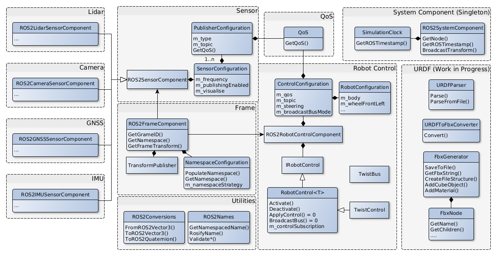

# O3DE Ros 2 Gem documentation
This is the API documentation of the O3DE Ros2 Gem.
## Diagram of classes
Some classes with relationships and functions are presented on this diagram. Specific sensor classes (e.g. Lidar) are not included.
